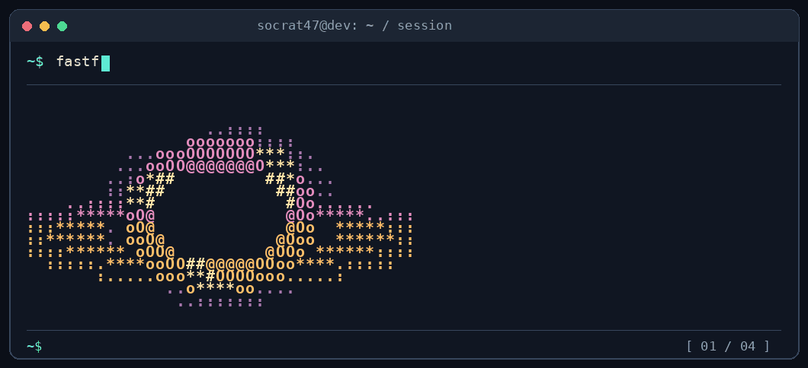

 

<a href="https://socratarvis.com.tr">Portfolio</a> ·
<a href="https://www.linkedin.com/in/serhatbekis/">LinkedIn</a> ·
<a href="https://www.instagram.com/socratarvis/">Instagram</a>

### `~$ cat mission.txt`

Full stack developer focused on useful web products, clear APIs, and backend architecture. I’m exploring AI and computer vision as tools for solving real problems.

### `~$ ls projects/`

- **[SmartShop](https://github.com/Socrat47/smartshop-fullstack)** — e-commerce web app and REST API; also see the [mobile app](https://github.com/Socrat47/smartshop-mobile).
- **[User Management System](https://github.com/Socrat47/User-Management-System)** — account management with JWT authentication, roles, and email notifications.
- **[Mood-detection AI experiment](https://github.com/Socrat47/JS-ile-duygudurumu-anlayan-yapayzeka)** — a JavaScript project exploring mood-aware AI.

### `~$ cat stack.txt`

`Go` · `Node.js` · `Express` · `React` · `Next.js` · `TypeScript` · `MongoDB` · `MySQL` · `MariaDB`

Terminal animation inspired by <a href="https://github.com/x0rzavi/github-readme-terminal">github-readme-terminal</a>.
