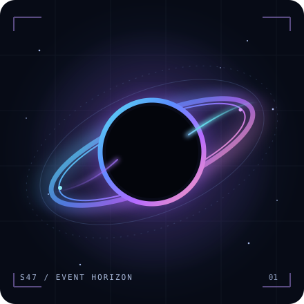

<div align="center">

<h1>Socrat <sub><code>@Socrat47</code></sub></h1>

<p><strong>Full stack developer</strong> · Backend architecture · AI & computer vision</p>

<p><code>BUILDING AT THE EDGE OF SOFTWARE & INTELLIGENCE</code></p>

</div>

<table>
  <tr>
    <td width="42%" align="center" valign="middle">
      
    </td>
    <td valign="middle">
      <h3><code>socrat@github:~$ fastfetch</code></h3>
      <p><code>────────────── ◉ ──────────────</code></p>
      <p>
        <code>Identity</code> &nbsp; Socrat / <a href="https://github.com/Socrat47">Socrat47</a><br />
        <code>Role</code> &nbsp;&nbsp;&nbsp;&nbsp;&nbsp; Full stack developer<br />
        <code>Focus</code> &nbsp;&nbsp;&nbsp; Scalable web apps & APIs<br />
        <code>Frontend</code> &nbsp; React · Next.js · TypeScript<br />
        <code>Backend</code> &nbsp;&nbsp; Go · Node.js · Express<br />
        <code>Data</code> &nbsp;&nbsp;&nbsp;&nbsp;&nbsp; MongoDB · MySQL · MariaDB<br />
        <code>Orbit</code> &nbsp;&nbsp;&nbsp; AI · computer vision · clean architecture
      </p>
      <p><code>●</code> <code>●</code> <code>●</code> <code>●</code> <code>●</code> <code>●</code> <code>●</code> <code>●</code></p>
    </td>
  </tr>
</table>

### `01 / mission`

I build practical products from interface to infrastructure. I enjoy designing backend systems, clear APIs, and user experiences that make complex work feel simple. I’m exploring how AI and computer vision can become useful parts of real products.

```text
> current trajectory
  ship useful software  →  improve the system  →  learn what comes next
```

### `02 / selected work`

| Project | What it explores | Stack |
| :--- | :--- | :--- |
| [SmartShop](https://github.com/Socrat47/smartshop-fullstack) | E-commerce platform with a web app and REST API; companion [mobile app](https://github.com/Socrat47/smartshop-mobile). | TypeScript, Express, React, MongoDB |
| [User Management System](https://github.com/Socrat47/User-Management-System) | Account management, JWT authentication, user roles, and email notifications. | React, Node.js, Express, MongoDB |
| [Mood-detection AI experiment](https://github.com/Socrat47/JS-ile-duygudurumu-anlayan-yapayzeka) | A JavaScript project exploring mood-aware AI. | JavaScript |

### `03 / toolkit`

| Layer | Tools |
| :--- | :--- |
| **Interfaces** | React · Next.js · JavaScript · TypeScript · Tailwind CSS |
| **Services** | Go · Node.js · Express · REST APIs |
| **Data** | MongoDB · MySQL · MariaDB |
| **Exploring** | gRPC · Redis Pub/Sub · WebSockets · AI & computer vision |

### `04 / establish contact`

[Portfolio](https://socratarvis.com.tr) · [LinkedIn](https://www.linkedin.com/in/serhatbekis/) · [Instagram](https://www.instagram.com/socratarvis/) · [GitHub](https://github.com/Socrat47)

<div align="center">
  <sub><code>signal received • keep building beyond the event horizon</code></sub>
</div>
